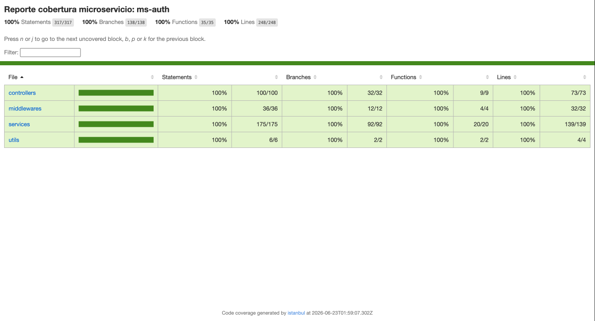

# MS-Auth — Sanos y Salvos

Microservicio de **autenticación** de la plataforma **Sanos y Salvos**. Su única responsabilidad es validar credenciales, emitir tokens JWT y gestionar el ciclo de vida de las sesiones. Mantiene una **réplica local de credenciales** sincronizada vía broker desde `ms-users`, lo que le permite autenticar usuarios incluso cuando `ms-users` está caído.

---

## Tecnologías

| Herramienta | Uso |
|---|---|
| Node.js 20 | Entorno de ejecución |
| Express 5 | Servidor HTTP |
| TypeScript 5 | Tipado estático |
| PostgreSQL 16 | Persistencia de credenciales y tokens |
| TypeORM 0.3 | ORM y sincronización de esquema |
| Bull + Redis | Cola de eventos desde ms-users (broker) |
| ioredis | Cliente Redis para caché KV de perfiles |
| jsonwebtoken | Generación y verificación de Access Tokens JWT |
| bcrypt | Verificación de contraseñas |
| Swagger / OpenAPI 3.0 | Documentación interactiva |
| Docker | Contenerización |

---

## Arquitectura

### Patrón arquitectónico

- **MVC (Model-View-Controller)**: Adaptado para APIs REST (Model-Route-Controller-Service). Los *Controllers* gestionan las solicitudes y respuestas HTTP, las *Routes* definen los endpoints, y la lógica de negocio se centraliza en los *Services*. Los *Models* representan las entidades de la base de datos.

### Patrón de diseño

- **Repository Pattern**: Utilizado a través de TypeORM para abstraer la capa de acceso a datos. Los servicios se comunican con los repositorios para realizar operaciones sobre la base de datos (CRUD) sin acoplarse directamente a sentencias SQL.

---

## Estructura del proyecto

```
ms-auth/
├── src/
│   ├── config/
│   │   ├── db.ts                   # Conexión PostgreSQL + TypeORM (Singleton)
│   │   ├── redis.ts                # Cola Bull + cliente Redis KV (Singleton)
│   │   └── swagger.ts              # Configuración OpenAPI 3.0
│   ├── controllers/
│   │   └── auth.controller.ts      # Handlers HTTP
│   ├── factories/
│   │   └── CredentialFactory.ts    # Factory para crear credenciales y refresh tokens
│   ├── middlewares/
│   │   ├── errorHandler.ts
│   │   ├── internalAuth.ts         # Verificación x-api-key para endpoints internos
│   │   ├── notFound.ts
│   │   └── verifyToken.ts          # Verificación JWT
│   ├── models/
│   │   ├── Credential.ts
│   │   ├── RefreshToken.ts
│   │   └── RevokedToken.ts
│   ├── queue/
│   │   └── consumers.ts            # Consumers de eventos desde ms-users
│   ├── routes/
│   │   └── auth.routes.ts
│   ├── services/
│   │   ├── auth.service.ts         # Lógica de autenticación
│   │   ├── types.ts                # Tipado de payloads de eventos
│   │   └── user-cache.service.ts   # Sincronización desde eventos del broker
│   ├── utils/
│   │   └── response.ts             # Helpers de respuesta HTTP estandarizada
│   ├── app.ts
│   └── server.ts                   # Entry point — crea BD si no existe, levanta consumers
├── Dockerfile
├── docker-compose.yml
├── package.json
└── tsconfig.json
```

---

## Documentación interactiva

```
http://localhost:3001/api/docs
```

---

## Endpoints

### Públicos

| Método | Ruta | Descripción |
|---|---|---|
| `POST` | `/api/auth/login` | Login. Devuelve `accessToken` + `refreshToken` |
| `POST` | `/api/auth/refresh` | Renueva el accessToken usando un refreshToken válido |
| `POST` | `/api/auth/logout` | Cierra sesión y revoca ambos tokens |

### Autenticados (Bearer Token)

| Método | Ruta | Descripción |
|---|---|---|
| `GET` | `/api/auth/me` | Perfil del usuario autenticado (desde caché Redis) |

### Internos (header `x-api-key`)

Endpoints administrativos protegidos por `x-api-key`. **Desde v2.0.0** la sincronización normal entre microservicios viaja por el **broker** (eventos), por lo que la mayoría de estos endpoints son **herramientas legacy de emergencia** para reparación manual cuando un evento se pierde.

| Método | Ruta | Uso |
|---|---|---|
| `POST` | `/api/auth/register` | Legacy — credenciales se crean vía evento `user.registered` |
| `PATCH` | `/api/auth/credentials/:id/role` | Legacy — rol se sincroniza vía evento `user.updated` |
| `PATCH` | `/api/auth/credentials/:id/deactivate` | Legacy — desactivación vía evento `user.deleted` |
| `DELETE` | `/api/auth/credentials/:id` | Emergencia — eliminar credencial huérfana |
| `POST` | `/api/auth/interno/por-email` | **Activo** — usado por ms-soporte para resolver `credential_id` por email |

---

## Postman — Listo para probar

> **URL base:** `http://localhost:3001`

### Variables de entorno sugeridas

En Postman, crea una environment con:

| Variable | Valor inicial |
|---|---|
| `baseUrl` | `http://localhost:3001` |
| `accessToken` | _(vacío — se completa tras login)_ |
| `refreshToken` | _(vacío — se completa tras login)_ |

> **Tip:** En la pestaña **Tests** del request de login, pega esto para guardar tokens automáticamente en la environment:
> ```javascript
> const res = pm.response.json();
> pm.environment.set("accessToken", res.data.accessToken);
> pm.environment.set("refreshToken", res.data.refreshToken);
> ```

### 1. Login

```http
POST {{baseUrl}}/api/auth/login
Content-Type: application/json
```

```json
{
  "email": "fe.ruizr@duocuc.cl",
  "password": "123456q"
}
```

### 2. Ver perfil autenticado

```http
GET {{baseUrl}}/api/auth/me
Authorization: Bearer {{accessToken}}
```

_(Sin body)_

### 3. Refresh Token

```http
POST {{baseUrl}}/api/auth/refresh
Content-Type: application/json
```

```json
{
  "refreshToken": "{{refreshToken}}"
}
```

### 4. Logout

```http
POST {{baseUrl}}/api/auth/logout
Authorization: Bearer {{accessToken}}
Content-Type: application/json
```

```json
{
  "refreshToken": "{{refreshToken}}"
}
```

### 5. Buscar credencial por email (interno)

```http
POST {{baseUrl}}/api/auth/interno/por-email
x-api-key: {{INTERNAL_API_KEY}}
Content-Type: application/json
```

```json
{
  "email": "fe.ruizr@duocuc.cl"
}
```

---

## Crear el primer superadmin

Como `ms-users` es la fuente de verdad del rol en v2.0.0, el procedimiento completo está documentado en **[ms-users/README.md → Crear el primer superadmin](../ms-users/README.md#crear-el-primer-superadmin-con-docker-corriendo)**.

Resumen del flujo:

1. Registrar usuario normal vía `POST /api/users/register/ciudadano`
2. `UPDATE users SET rol='superadmin'` en `ms-users-db`
3. `UPDATE credentials SET role='superadmin'` en `ms-auth-db` (réplica)
4. `FLUSHDB` en `ms-auth-redis` para invalidar caché


---

## Pruebas Unitarias

El proyecto cuenta con una suite de pruebas unitarias para garantizar la calidad y el correcto funcionamiento de los servicios.

**Ejecutar las pruebas:**
```bash
npm run test
```

**Generar reporte de cobertura:**
```bash
npm run test:coverage
```

Para visualizar el reporte de cobertura detallado, abre el archivo generado en tu navegador:
```bash
open coverage/index.html
```

**Reporte de cobertura test microservicio:**

